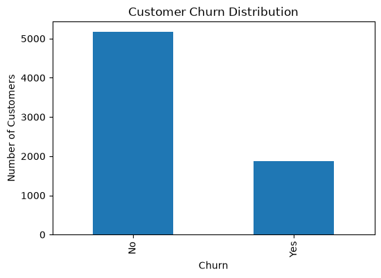
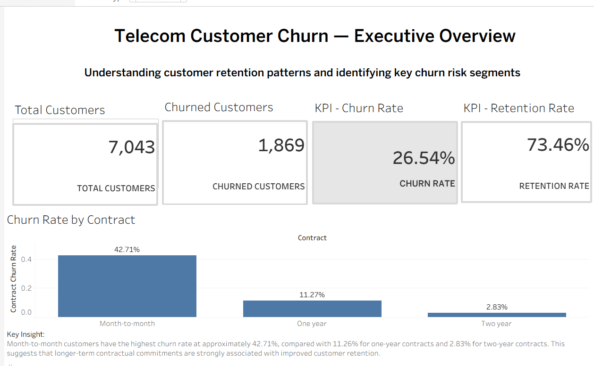
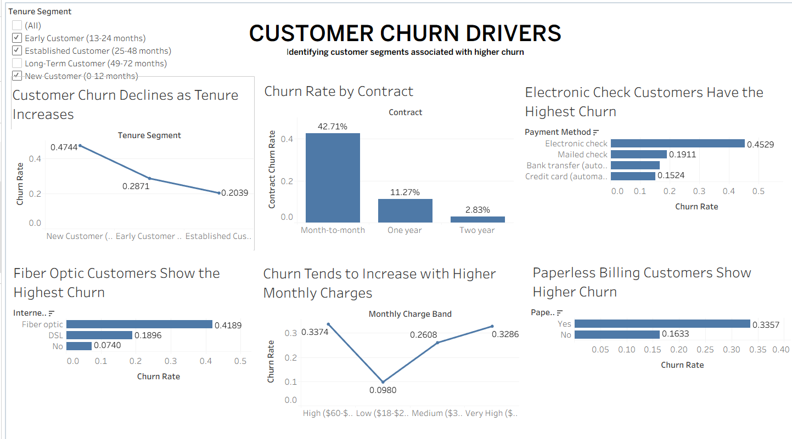

# Telecom Customer Churn Analysis

A data analytics case study investigating customer churn within a telecommunications company. Built using Python, SQL, DuckDB, and Tableau, the project focuses on identifying the customer segments and service characteristics associated with customer attrition.

The goal is not simply to describe the data, but to answer a real business question:

**Why are customers leaving, which customers are most at risk, and where should the company focus its retention efforts?**



> 26.54% of customers have churned, with the highest risk concentrated among new customers, month-to-month contract holders, Fiber Optic customers, and high-risk customer segments.

---

## Key Findings

| Finding | What the data says |
|---|---|
| Overall churn | 26.54% of customers have churned |
| Customer retention | 73.46% of customers remain with the company |
| Churned customers | 1,869 customers have left the company |
| New customer risk | 47.44% churn rate for customers with 0-12 months tenure |
| Early customer risk | 28.71% churn rate for customers with 13-24 months tenure |
| Long-term retention | 9.51% churn rate for customers with 49-72 months tenure |
| Monthly charges | Churned customers average $74.44 per month vs. $61.27 for retained customers |
| Internet service risk | Fiber Optic customers have a 41.89% churn rate |
| Service engagement | High-engagement customers have a 10.06% churn rate |
| High-risk segment | High-risk customers have an 82.78% churn rate |

The results indicate that customer churn is not evenly distributed across the customer base. Risk is concentrated within specific customer segments, creating opportunities for targeted retention strategies.

---

## The Four Analyses

### 1. Exploratory Data Analysis

`notebooks/01_eda.ipynb`

The exploratory analysis investigates the overall distribution of customer churn and examines relationships between churn and key customer characteristics.

The analysis covers:

- Overall customer churn distribution
- Customer tenure
- Monthly charges
- Contract type
- Internet service
- Payment method
- Paperless billing
- Online Security
- Tech Support
- Customer service engagement

### Overall Churn

The analysis found that:

- **73.46%** of customers remained with the company.
- **26.54%** of customers churned.
- **1,869 customers** had churned.

Although the majority of customers remain with the company, more than one-quarter of the customer base has churned. For a subscription-based telecommunications business, this represents a significant customer retention challenge and a potential loss of recurring revenue.

### Customer Tenure and Churn

Customer tenure showed a strong relationship with churn.

Customers with shorter relationships with the company were substantially more likely to churn than long-term customers.

The analysis found:

| Tenure Segment | Churn Rate |
|---|---:|
| New Customer (0-12 months) | 47.44% |
| Early Customer (13-24 months) | 28.71% |
| Established Customer (25-48 months) | 20.39% |
| Long-Term Customer (49-72 months) | 9.51% |

The results indicate that the early stage of the customer lifecycle is a particularly high-risk period.

New customers had a churn rate of approximately **47.44%**, while long-term customers had a churn rate of only **9.51%**.

This suggests that customer retention strategies should place strong emphasis on the first year of the customer relationship.

### Monthly Charges and Churn

The analysis also examined the relationship between monthly charges and customer churn.

Customers who churned had an average monthly charge of approximately **$74.44**, compared with approximately **$61.27** for customers who remained with the company.

This indicates that churned customers generally paid higher monthly charges than retained customers.

Higher-paying customers may have greater expectations regarding service quality, reliability, and value. If these expectations are not met, customers may be more likely to switch to competitors.

### Contract Type and Churn

Contract type was identified as an important factor associated with customer churn.

Customers on **month-to-month contracts** demonstrated substantially higher churn rates than customers on one-year and two-year contracts.

This suggests that customers with shorter contractual commitments may have lower switching barriers and greater flexibility to leave the company.

Longer-term contracts appear to be associated with stronger customer retention and more predictable recurring revenue.

### Internet Service and Churn

The analysis found significant differences in churn across internet service types.

| Internet Service | Churn Rate |
|---|---:|
| Fiber optic | 41.89% |
| DSL | 18.96% |
| No internet service | 7.40% |

Fiber Optic customers recorded the highest churn rate at approximately **41.89%**.

This means that nearly two out of every five Fiber Optic customers in the dataset had churned.

The company should investigate whether this pattern is related to:

- Pricing
- Network reliability
- Service quality
- Customer expectations
- Competitive alternatives

The results identify Fiber Optic customers as an important segment for further investigation and retention efforts.

---

### 2. Feature Engineering and Customer Segmentation

`notebooks/02_feature_engineering.ipynb`

Feature engineering was performed to transform existing customer attributes into meaningful segments that make customer churn easier to analyze and interpret.

The analysis created and examined:

- `TenureSegment`
- `ServiceEngagementLevel`
- `MonthlyChargeBand`
- `HighRiskCustomer`

### Tenure Segmentation

Customers were grouped into four lifecycle categories:

- New Customer (0-12 months)
- Early Customer (13-24 months)
- Established Customer (25-48 months)
- Long-Term Customer (49-72 months)

**Key finding:** Churn decreases substantially as customer tenure increases.

New customers have a 47.44% churn rate, compared with only 9.51% among long-term customers.

This indicates that the first year of the customer relationship is a critical retention window.

### Service Engagement

Customers were categorized based on their level of service engagement.

| Engagement Level | Churn Rate |
|---|---:|
| Low Engagement | 29.75% |
| Moderate Engagement | 31.56% |
| High Engagement | 10.06% |

**Key finding:** Highly engaged customers are significantly less likely to churn than customers with low or moderate engagement.

This suggests that customers who use more services may have stronger relationships with the company and may be less likely to leave.

### High-Risk Customer Segment

A `HighRiskCustomer` feature was engineered to identify customers with characteristics associated with elevated churn risk.

| Customer Segment | Churn Rate |
|---|---:|
| High Risk | 82.78% |
| Other | 25.30% |

**Key finding:** The engineered high-risk segment has an extremely high churn rate, demonstrating the potential value of customer segmentation for targeted retention campaigns.

### Monthly Charge Band

Customers were grouped into monthly charge categories to investigate whether pricing levels were associated with customer churn.

The monthly charge bands were used to make it easier to compare customer churn across different pricing levels and identify potential high-value customer segments that may require targeted retention strategies.

---

### 3. SQL Business Analysis

`sql/churn_analysis.sql`

SQL and DuckDB were used to answer structured business questions against the cleaned customer dataset.

The analysis investigates:

- Overall customer churn rate
- Churn rate by contract type
- Churn rate by internet service
- Churn rate by tenure segment
- Churn rate by monthly charge band
- Customer risk characteristics

The SQL analysis provides a reproducible way to answer business questions using structured data queries rather than relying only on notebook-based analysis.

### Key Finding

The SQL analysis confirms that churn is concentrated among specific customer groups rather than being evenly distributed across the customer base.

Month-to-month contract customers, Fiber Optic customers, newer customers, and high-risk customer profiles represent particularly important segments for retention analysis.

---

### 4. Interactive Tableau Dashboards

`tableau/`

The Tableau dashboards transform the analytical findings into interactive business intelligence visualizations.

The project includes two main dashboards.

### Dashboard 1 — Executive Churn Overview

The first dashboard provides a high-level view of the company's customer retention position.

Key Performance Indicators include:

- **Churn Rate: 26.54%**
- **Retention Rate: 73.46%**
- **Churned Customers: 1,869**

The dashboard allows stakeholders to quickly understand the scale of customer attrition and explore the overall customer base.



### Business Question

**How serious is the company's customer churn problem?**

The dashboard provides an immediate overview of the company's retention position and establishes the overall scale of the customer churn challenge.

### Dashboard 2 — Customer Churn Drivers

The second dashboard focuses on identifying the customer characteristics and service factors associated with higher churn.

The dashboard explores areas including:

- Customer tenure
- Monthly charges
- Contract type
- Internet service
- Customer segmentation
- Customer risk characteristics



### Business Question

**What factors and customer characteristics are associated with higher churn?**

The dashboard highlights the customer groups that require greater attention from the business and supports data-driven retention decisions.

---

## Key Business Insights

The combined Python, feature engineering, SQL, and Tableau analysis produced several important findings.

### 1. Customer churn is significant

The overall churn rate is **26.54%**, meaning more than one-quarter of the customer base has churned.

Although 73.46% of customers remain active, the number of churned customers represents a significant opportunity for improving customer retention.

### 2. New customers are at the highest risk

New customers have a churn rate of approximately **47.44%**, while long-term customers have a churn rate of only **9.51%**.

The first year of the customer relationship is therefore a critical retention period.

### 3. Month-to-month contracts have higher churn

Customers on month-to-month contracts are considerably more likely to churn than customers on longer-term contracts.

This suggests that customers with longer contractual commitments may have stronger retention and lower switching behaviour.

### 4. Fiber Optic customers have elevated churn

Fiber Optic customers have a churn rate of approximately **41.89%**, making them one of the highest-risk customer groups identified in the analysis.

The company should investigate pricing, service quality, network reliability, and customer expectations within this segment.

### 5. Higher monthly charges are associated with churn

Customers who churned had an average monthly charge of **$74.44**, compared with **$61.27** for customers who remained with the company.

This suggests that pricing and perceived value may play an important role in customer retention.

### 6. Service engagement is associated with retention

Customers with high service engagement recorded a churn rate of approximately **10.06%**, substantially lower than customers with low or moderate engagement.

This suggests that customers who use more services may have stronger relationships with the company.

### 7. High-risk customer segmentation is effective

The engineered `HighRiskCustomer` segment recorded a churn rate of approximately **82.78%**, compared with **25.30%** among other customers.

This indicates that combining relevant customer characteristics into a risk segment can help identify customers who require immediate retention attention.

---

## Business Impact

The analysis identifies several areas where targeted retention strategies could potentially reduce customer churn.

### 1. Improve Early Customer Retention

New customers have a 47.44% churn rate, making the first year of the customer relationship the most critical retention period.

The company could introduce:

- Structured onboarding programs
- Early customer satisfaction checks
- Proactive customer support
- First-year loyalty incentives
- Personalized engagement campaigns

### 2. Encourage Longer-Term Contracts

Month-to-month customers show substantially higher churn than customers on longer-term contracts.

Potential strategies include:

- Discounts for contract upgrades
- Loyalty benefits
- Long-term pricing incentives
- Additional services for customers who commit to longer contracts

### 3. Investigate Fiber Optic Customer Churn

Fiber Optic customers have a 41.89% churn rate, significantly higher than DSL customers at 18.96%.

The company should investigate whether this is associated with:

- Pricing
- Network reliability
- Service quality
- Customer expectations
- Competitive alternatives

### 4. Target High-Risk Customers

The engineered high-risk customer segment has an 82.78% churn rate.

This provides an opportunity to develop targeted retention campaigns that prioritize customers who are most likely to leave.

Possible interventions include:

- Personalized retention offers
- Proactive customer outreach
- Dedicated customer support
- Loyalty incentives
- Early warning systems

### 5. Increase Customer Engagement

High-engagement customers have a churn rate of only 10.06%.

The company could explore opportunities to increase engagement through:

- Service bundles
- Cross-selling relevant services
- Loyalty programs
- Value-added products

The objective would be to strengthen the overall customer relationship and increase customer lifetime value.

---

## Recommended Retention Strategy

Based on the analysis, retention efforts should be prioritized according to customer risk rather than applying the same strategy to the entire customer base.

The highest-priority segments are:

```text
New Customers
      +
Month-to-Month Contract Customers
      +
Fiber Optic Customers
      +
High-Risk Customer Profiles
      ↓
Targeted Retention Campaigns
      ↓
Improved Customer Engagement
      ↓
Reduced Churn
Telecom-Customer-Churn-Analysis/
│
├── assets/
│   ├── churn_distribution.png
│   ├── dashboard_1.png
│   └── dashboard_2.png
│
├── data/
│   ├── raw/
│   │   └── WA_Fn-UseC_-Telco-Customer-Churn.csv
│   │
│   └── processed/
│       └── telco_Customer_Churn_clean.csv
│
├── notebooks/
│   ├── 01_eda.ipynb
│   └── 02_feature_engineering.ipynb
│
├── sql/
│   └── churn_analysis.sql
│
├── tableau/
│   └── Telecom_Customer_Churn_Analysis.twbx
│
├── run_sql.py
├── requirements.txt
├── .gitignore
└── README.md